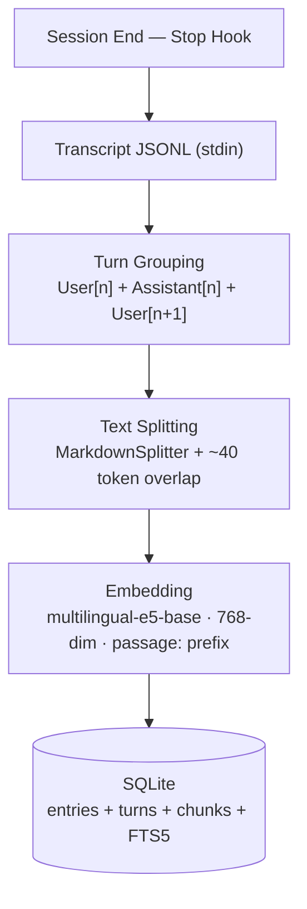
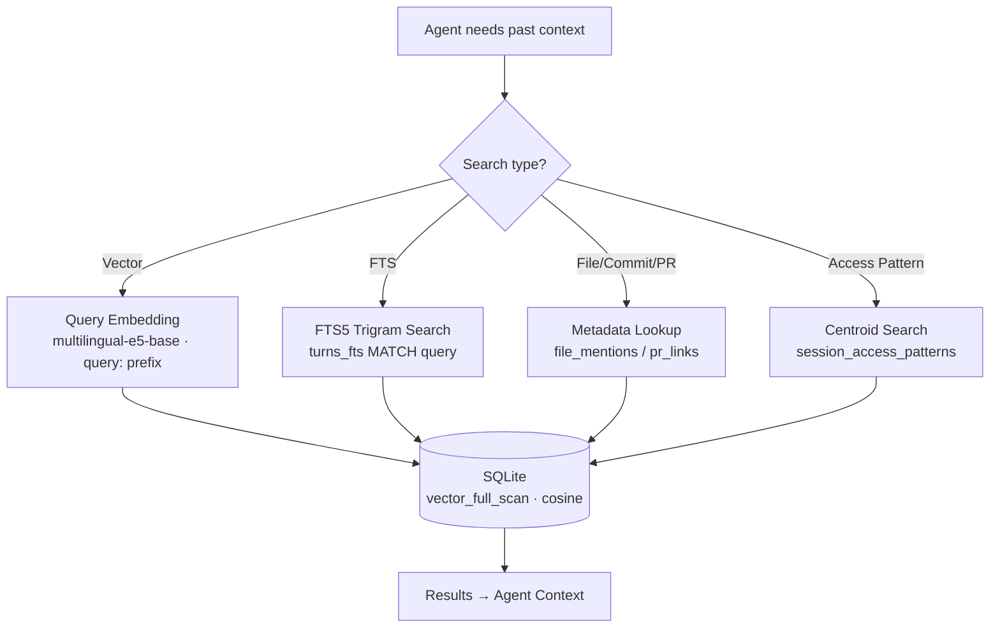

# Mementor

**Local RAG Memory Agent for Claude Code**

## Vision

Claude Code loses all context when a session ends. Mementor gives it persistent
memory by vectorizing conversation transcripts into a local SQLite database.
The AI agent actively searches past context when it needs historical decisions,
previous implementations, or related work patterns.

No external APIs. No cloud services. Everything runs locally on your machine.

## Features

- **Active agent-driven search** -- The agent decides when and what to search
  via CLI subcommands and a Claude Code plugin. No forced context injection.
- **Multilingual embedding** -- Uses multilingual-e5-base (768-dim) for
  cross-language search across English, Korean, Japanese, and more.
- **Vector + full-text search** -- Combines cosine similarity search with
  FTS5 trigram keyword search for comprehensive retrieval.
- **Structured session browsing** -- Browse sessions, navigate turns, search by
  file path, commit hash, or PR number.
- **Access pattern search** -- Find past sessions that touched similar files
  using centroid-based vector similarity.
- **Incremental transcript ingestion** -- Only processes new lines from
  transcript files, tracking progress with `last_line_index` and provisional
  turn state.
- **Turn-based chunking with forward context** -- Groups messages into turns
  (User[n] + Assistant[n] + User[n+1]) for semantically coherent chunks.
- **SQLite + sqlite-vector** -- Vector storage and cosine similarity search in a
  single SQLite database file. No separate vector DB service required.
- **Claude Code plugin** -- Skills and an autonomous research agent make search
  capabilities available to the AI agent automatically.

## Tech Stack

| Component        | Choice                                              |
| ---------------- | --------------------------------------------------- |
| Language         | Rust (edition 2024)                                 |
| Database         | SQLite via rusqlite (bundled)                        |
| Vector search    | sqlite-vector (statically compiled)                 |
| Embedding        | fastembed-rs + multilingual-e5-base ONNX (768-dim)  |
| Text splitting   | text-splitter with MarkdownSplitter                 |
| Full-text search | FTS5 with trigram tokenizer                         |
| CLI              | clap                                                |

## Install

```bash
mementor model download    # download multilingual-e5-base (~880 MB, one-time)
cargo build --release
```

The binary is produced at `target/release/mementor`.

## Quick Start

1. **Enable Mementor** in your project:

   ```bash
   mementor enable
   ```

   This installs the mementor Claude Code plugin, which provides skills, an
   autonomous research agent, and lifecycle hooks for automatic ingestion.

2. **Use Claude Code normally.** Mementor works in the background:
   - When a session ends, the **Stop hook** ingests the conversation transcript.
   - When the agent needs past context, it invokes the **recall skill** or
     **memory-researcher agent** to search.

3. That is it. Claude Code now remembers across sessions.

## CLI Reference

### Search

```bash
mementor search "<query>" [--fts] [--session <id>] [--json] [--offset N] [--limit N]
```

Search past conversations. Default: vector search with asymmetric `query: `
prefix. `--fts`: FTS5 trigram keyword search. `--session`: scope to a specific
session.

### Session Browsing

```bash
mementor sessions list [--json] [--limit N] [--oldest|--latest]
mementor sessions get <session-id> [--json]
```

List sessions with metadata (turn count, compaction count) or get detailed info
for a single session (file count, subagent count, PR links).

### Turn Viewing

```bash
mementor turns get <session> [--json] [--offset N] [--limit N] [--segment N] [--current]
```

View turns from a specific session. `--segment N`: view turns in the Nth
compaction segment. `--current`: view turns after the last compaction boundary.

### Compaction Summaries

```bash
mementor compactions list <session> [--json] [--limit N] [--oldest|--latest]
```

View compaction summaries for a session. Useful for understanding session
structure without reading every turn.

### Lookup by File, Commit, or PR

```bash
mementor find-by-file <path> [--json] [--limit N]
mementor find-by-commit <hash> [--json] [--limit N]
mementor find-by-pr <number> [--json] [--limit N]
```

Find sessions and turns by file path, commit hash, or PR number.

### Access Pattern Search

```bash
mementor find-related sessions <session-id> [--json] [--limit N]
mementor find-related turns <session-id> [--json] [--recent N] [--limit N]
```

Find sessions or turns with similar file access patterns using centroid-based
vector similarity.

### Data Management

```bash
mementor model download [--force]    # download the embedding model
mementor reindex                     # re-ingest all transcripts from scratch
mementor enable                      # install the Claude Code plugin
```

### Hook Entry Points

```bash
mementor hook stop                   # called by Stop lifecycle hook
mementor hook pre-compact            # called by PreCompact lifecycle hook
```

These are invoked automatically by the plugin's hooks. No manual use needed.

## Architecture

### Three-Layer Data Model

```
entries (original transcript messages) ← turns (embedding groups) ← chunks (search indices)
```

From any search result: `chunk → turn → entries via line_index range → session`

### Ingestion (Stop Hook)



### Search (Agent-Driven)



### Workspace Structure

```
crates/
  mementor-lib/    Core library: DB, embedding, chunking, schema, traits
  mementor-cli/    CLI layer: command dispatch, argument parsing, DI
  mementor-main/   Thin binary entry point: wires real implementations
plugin/
  skills/          Claude Code plugin skills (recall, sessions, turns, etc.)
  agents/          Autonomous research agent (memory-researcher)
  hooks/           Stop + PreCompact hook definitions
vendor/
  sqlite-vector/   C source files for static compilation
```

## Development

### Prerequisites

- Rust 1.93.1+ (managed via [mise](https://mise.jdx.dev/))
- On Intel Mac: Homebrew `onnxruntime` (see CLAUDE.md)

### Setup

```bash
mise install
mementor model download    # fetches multilingual-e5-base (~880 MB)
cargo build
```

### Testing

```bash
mise run test              # all tests (unit + integration)
mise run test:unit         # unit tests only
```

## License

This project is licensed under the [MIT License](LICENSE).

> **Note**: This project statically links sqlite-vector, which is distributed
> under the [Elastic License 2.0](https://www.elastic.co/licensing/elastic-license).
> The Elastic License 2.0 permits most use cases but restricts providing the
> software as a managed service. Review the license terms before redistribution.

## Acknowledgments

Inspired by [Entire CLI](https://github.com/entireio/cli), a developer platform
that hooks into Git workflows to capture AI agent sessions on every push.
Mementor takes a different approach — instead of recording sessions for external
review, it vectorizes transcripts locally and provides active search tools,
giving Claude Code persistent cross-session memory.
